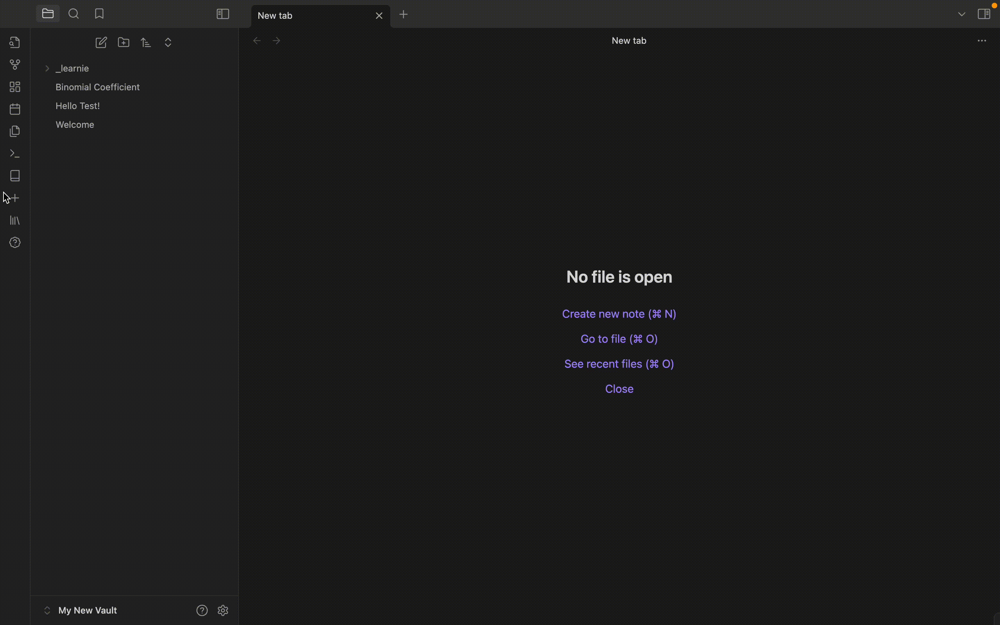
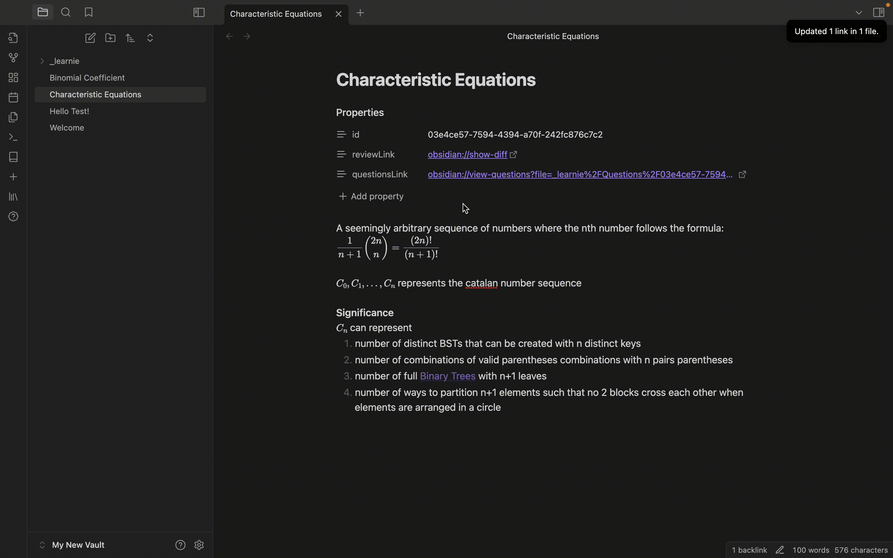
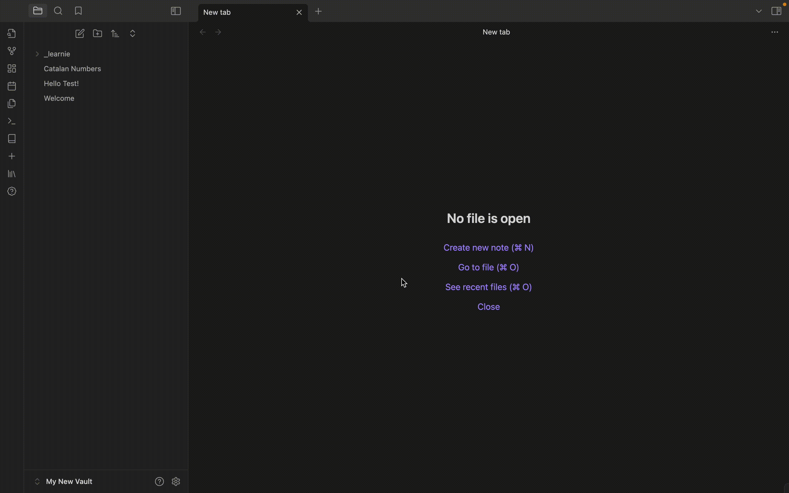
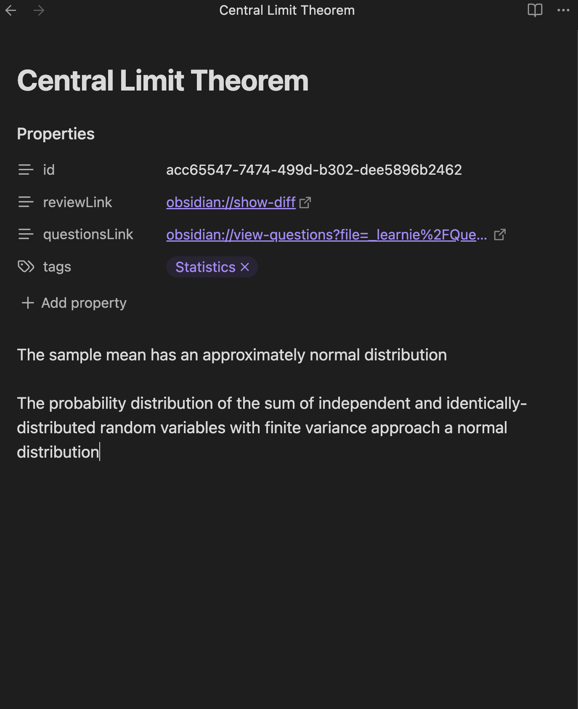

# Learnie: Enhance Your Learning with Active Recall and Spaced Repetition

## Introduction

Learnie is an Obsidian plugin designed to help students and lifelong learners remember and learn more effectively. By incorporating contemporary learning techniques like active recall and spaced repetition, Learnie transforms your Obsidian vault into a powerful learning tool.

**Issues/Suggestions**: Please report any issues encountered or feature suggestions as a GitHub issue. For issues, include the context as well as screenshots (if applicable) so that it's easier to reproduce the error.

## Key Features

### 1. Creating/Converting Notes for Tracking

Easily convert any file into a note by typing the command "Convert to note". This process updates the frontmatter of the file to include a unique note ID and links to additional generated files like a revision and question file.

**Converting a note** - You can also convert any pre-existing file into a note by using the "Convert to note" command

### 2. Track Changes with the Diff View

Each tracked note is assigned an ID and includes links to view the differences between the current note and the last modified version. This feature allows you to see what has changed in your notes over time, helping you keep track of your revisions and edits effortlessly.

### 3. Create and Review Questions

Create review questions directly within your notes. Select text to automatically use it as an answer, streamlining the question creation process. This feature uses the flashcard strategy and helps you prepare for exams by regularly reviewing the questions you've created. *Note that questions can only be created for valid notes*

**Create new questions**

**Update questions**

### 4. Daily Review

View all notes that were changed in a day, facilitating regular review sessions and helping you stay on top of your learning material.

We also have **auto-reminders** which remind you at a specific time every day, and automatically opens up all notes to review for you

### 5. Review Marking

Mark note revisions as reviewed to keep track of your progress and ensure no changes slip through the cracks.

### 6. Flashcard Quizzes

**Quizzes**
You can easily create flashcard-like quizzes which takes a fixed number of questions every time. You can even choose what topics to test yourself on by adding a tag into the note's `tags` property like so below

*Note that it has to specifically be in a Learnie note with the tags property. Notes created before an earlier update may not have this property, and you simply just need to create a new "tags" property*

Then when starting a quiz, choose the topics you wish to test yourself on and voila!

**View all questions** - You can also view all questions across all notes if you'd like

### 7. Settings
Currently configurable settings
1. Daily review notification timing
2. Number of quiz questions to show at a time

## Perfect for

- Students overwhelmed by large amounts of content to memorize
- Obsidian users looking to enhance their note-taking and learning process
- Anyone who believes in the power of accumulated learning over cramming

## How It Works

**File Storage:**
When creating a note, 2 files are generated:
1. **Revision file**: This creates a revision file in a ` _learnie` folder, which stores the content of the file when you first converted it to a note
2. **Question file**: This also crestes a question file in the same `_learnie` folder which the note is associated with
3. The `id` property in the frontmatter is used to link both files together

**Frontmatter**
We use the frontmatter to store important details like a note's id, whether it's been reviewed already, and the list of questions

## Commands
1. **Convert to note** - Converts a file into a note, and edits are tracked
2. **Review notes** - View list of all notes that were changed within the day OR has not yet been reviewed (This means that only notes in the past nad haven't yet been reviewed will show up in this list)
3. **View questions** - Views a list of all created questions for the active file
4. **Create question** - Creates a new question. highlighted text will automatically be used as the answer of the question pair
5. **Modify questions** - Allows modifying questions associated with the active file
6. **Clean up unused files** - This removes all note revisions and files that are not used by any notes (This should not be needed)

---

## Planned Enhancements

## (Really) Future Enhancements
- [ ] Create questions with context
	- [ ] Users can create multiple questions for the same context

## Completed features
- [x] Fix bug where text is deleted after being idle on an active note for a some time
- [x] Allow users to modify questions
- [x] Add daily notification which reminds users to review their notes at a certain time
- [x] Review Questions: Opens a view with 10 random questions that have not yet been reviewed today
- [x] Allow users to view questions of a specific topic/s

**Note**: Learnie is in early development and may have some instabilities. Regular updates will be provided to improve functionality and user experience.

